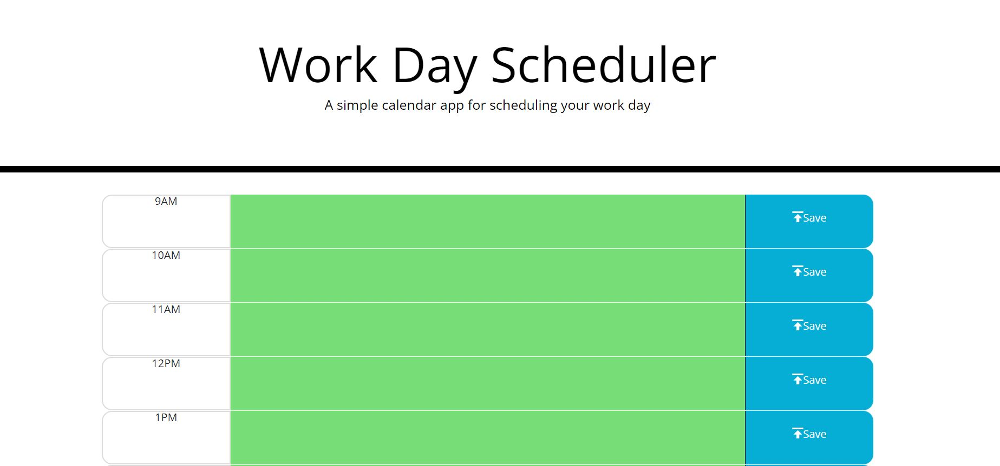

# 5-Work-Day-Scheduler

## Description

This repository is for the 5th weekly challenge for the University of Minnesota coding boot camp submitted by Tony Busch. 

## Usage

The page for this project can be found at https://tbusch74.github.io/5-Work-Day-Scheduler/

See below for a screenshot of the finished webpage.

## Credits

This page was initially created by Tony Busch. 
